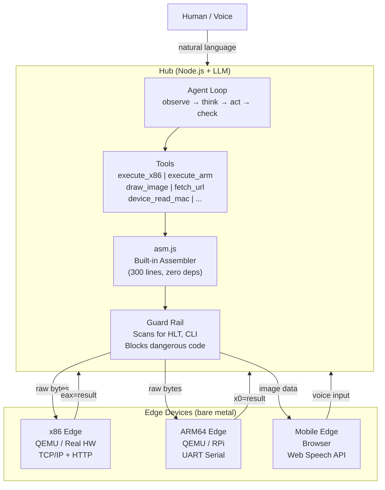
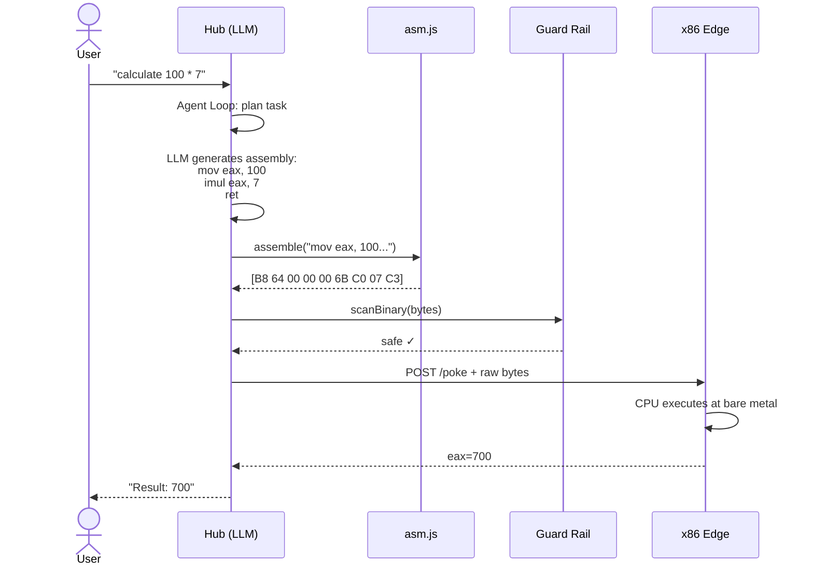
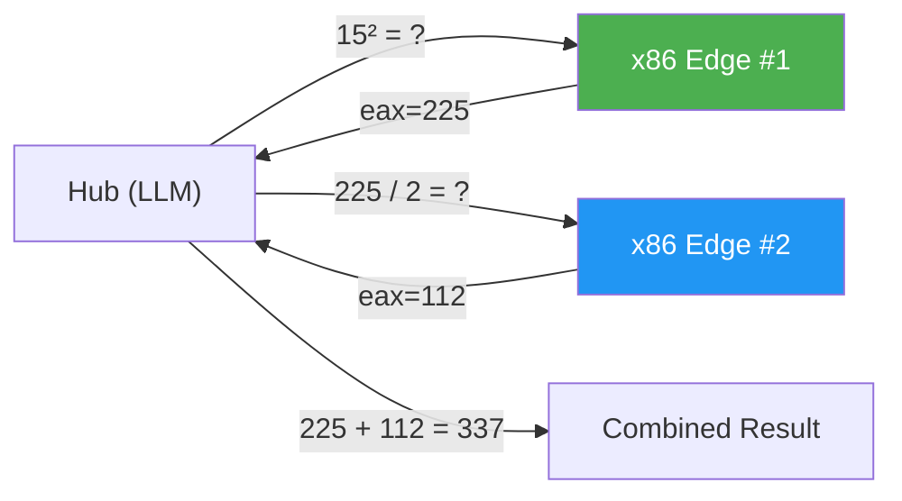
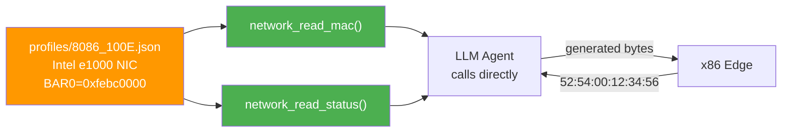
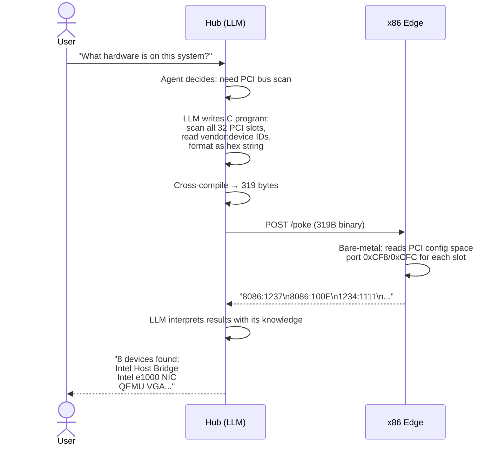
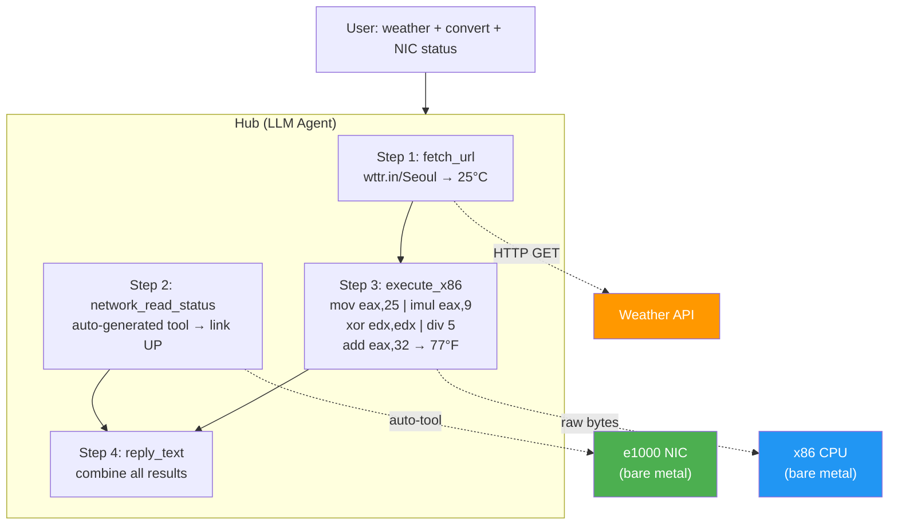

<p align="center">
  <h1 align="center">POKE</h1>
  <p align="center"><strong>Protocol for Open Kernel Execution</strong></p>
  <p align="center">by <strong>Orvian</strong> — from Orbit and Via, the path that carries intelligence into machines.</p>
  <p align="center">
    <a href="https://www.npmjs.com/package/@orvian/poke"></a>
    <a href="LICENSE"></a>
    <a href="#quick-start">Quick Start</a> &middot;
    <a href="#why-poke-exists">Why</a> &middot;
    <a href="#architecture">Architecture</a> &middot;
    <a href="#protocol">Protocol</a> &middot;
    <a href="CONTRIBUTING.md">Contributing</a>
  </p>
</p>

---

**MCP connects AI to software. POKE connects AI to hardware.**

```
You: "Calculate 2 + 3"
  → Hub (LLM): generates x86 machine code
  → Edge (bare metal): executes raw bytes on CPU
  → Result: eax=5
```

No operating system. No drivers. No apps. Just AI talking directly to hardware.

---

## Why POKE Exists

### The OS was built for humans, not for AI.

Operating systems exist because humans needed abstraction. We couldn't write raw machine code for every task, so we built layers:

```
1960s  Hardware only          Humans write machine code by hand
1970s  Operating Systems      Abstraction layer — files, processes, memory management
1980s  Drivers                Hardware abstraction — one interface for many devices
1990s  Libraries & Frameworks Code reuse — don't reinvent the wheel
2000s  App Stores             Distribution — package everything into apps
2020s  AI / LLM               Machines that understand language and generate code
```

Every layer was created because **humans couldn't do it themselves**. The OS, drivers, libraries — they're all **pre-built solutions for human limitations**.

But LLMs don't have those limitations. An LLM can:
- Generate machine code on the fly (no need for pre-compiled binaries)
- Understand any hardware spec (no need for pre-written drivers)
- Interpret natural language (no need for app UIs)

**If "pre-building" is unnecessary, the OS is unnecessary.**

What remains is the bare minimum: hardware + network + a protocol to inject and execute code.

That's POKE.

```
Traditional:  Human → App → Framework → OS → Driver → Hardware
POKE:         Human → LLM → Machine Code → Hardware
```

### The End of Permanent Binaries

Every program you use today is a **permanent binary** — compiled once, installed, stored on disk, updated periodically. This made sense when compilation was expensive and humans needed stable, repeatable software.

But POKE flips this model. Binaries become **ephemeral**:

```
Traditional (permanent):
  Write code → compile → install → store on disk → run forever
  Update? Recompile → reinstall → restart

POKE (ephemeral):
  Speak → LLM generates binary → inject → execute → discard
  Next request? Generate a new binary from scratch
```

A POKE binary lives for **milliseconds**. It's generated on demand, tailored to the exact request, executed once, and thrown away. There's nothing to install, nothing to update, nothing to patch.

This changes everything:
- **No software updates.** Every execution is freshly generated.
- **No version conflicts.** There's no installed version — just the current intent.
- **No attack persistence.** Malware can't persist in a binary that doesn't exist after execution.
- **No bloat.** Each binary contains exactly the code needed — nothing more.

The future isn't permanent software running on an OS. It's **volatile binaries generated in real-time by AI, executed directly on hardware, and discarded.**

### POKE vs MCP

| | MCP | POKE |
|---|---|---|
| Connects AI to | Software tools | Hardware devices |
| Execution | API calls (JSON-RPC) | Machine code injection |
| Abstraction | High | None (bare metal) |
| Controls | Apps, databases, APIs | Registers, GPIO, peripherals |
| Requires | Tool server | Edge runtime + device profile |

MCP gives AI hands in the software world. POKE gives AI hands in the physical world.

---

## Quick Start

> **Platform support:** Currently tested on **macOS** (Apple Silicon & Intel) and **Linux x86_64**. Windows users should use WSL2. Docker option works on any platform with Docker Desktop.

### Option 1: npm — Hub only

Starts the **hub (LLM agent server) only**. No bare-metal edge. Use this if you already have edge devices running, or just want to explore the hub API.

```bash
# Install
npm install -g @orvian/poke

# Configure LLM API key (required)
# Get a key at https://console.anthropic.com → API Keys → Create Key
echo "ANTHROPIC_API_KEY=sk-ant-your-key-here" > .env

# Start hub
poke
# → POKE Hub running on http://localhost:3333
```

> **Note:** Hub only — no edge devices are started. You can register external edges via `POST /enroll`, or use Option 2 for the full experience.

### Option 2: Docker — Hub + Edge (recommended)

Starts **everything**: bare-metal x86 kernel (compiled from source inside Docker), QEMU edge, hub, and auto-registration. Nothing to install except Docker.

```bash
git clone https://github.com/CSP911/poke.git
cd poke

# Configure (required)
cp .env.example .env
# Edit .env — add your Anthropic API key:
#   ANTHROPIC_API_KEY=sk-ant-your-key-here
#   HUB_SECRET=optional-secret-for-auth

# Start everything (builds kernel from source automatically)
docker compose up --build
```

| Service | Port | What it does |
|---------|------|-------------|
| **Edge** | 8080 | Bare-metal x86 OS in QEMU (kernel built from source) |
| **Hub** | 3333 | LLM agent server (connects to Claude API) |
| **Setup** | — | Auto-registers edge with hub, then exits |

> **What happens:** Docker compiles the x86 kernel using `nasm` + `gcc -m32`, boots it in QEMU, starts the hub, and registers the edge — all from a fresh clone. No cross-compiler needed on your machine.

### Option 3: Manual — Full control

For developers who want to modify the kernel or run multiple edges. Requires **macOS or Linux x86_64**.

```bash
# Prerequisites
# macOS:  brew install nasm qemu i686-elf-gcc
# Ubuntu: apt install nasm qemu-system-x86 gcc-multilib

# Build and start x86 edge
make                    # Compile kernel → poke.img
make run                # Start QEMU edge on port 8080

# In another terminal: install deps + start hub
npm install
echo "ANTHROPIC_API_KEY=sk-ant-your-key-here" > .env
node src/hub.js         # Hub on port 3333

# Register edge with hub
curl -X POST http://localhost:3333/enroll \
  -H 'Content-Type: application/json' \
  -d '{"node_id":"x86","endpoint":"http://localhost:8080","arch":"i386"}'
```

> **What you get:** Hub + one x86 edge. You can start more edges on different ports, add ARM edges, or connect real hardware.

### Try it — natural language commands

The `/relay` endpoint accepts any natural language. The LLM agent decides what to do — compute, read hardware, fetch APIs, or combine all of them.

```bash
# Math → LLM generates assembly → bare-metal CPU executes
curl -X POST http://localhost:3333/relay \
  -H 'Content-Type: application/json' \
  -d '{"from":"x86-edge","command":"calculate 100 * 7"}'
# → { "result": "eax=700" }

# Hardware scan → LLM writes C program → compiles → injects → interprets
curl -X POST http://localhost:3333/relay \
  -H 'Content-Type: application/json' \
  -d '{"from":"x86-edge","command":"what hardware is connected to this machine?"}'
# → "8 devices found: Intel NIC, QEMU VGA, VirtIO RNG..."

# Device control → auto-generated tool from profile
curl -X POST http://localhost:3333/relay \
  -H 'Content-Type: application/json' \
  -d '{"from":"x86-edge","command":"read the network card MAC address"}'
# → "MAC: 52:54:00:12:34:56"

# External API + CPU compute in one command
curl -X POST http://localhost:3333/relay \
  -H 'Content-Type: application/json' \
  -d '{"from":"x86-edge","command":"get Seoul weather and convert temperature to Fahrenheit"}'
# → agent fetches weather API, then runs (25*9/5)+32 on bare-metal CPU → "25°C = 77°F"

# Sensor reading
curl -X POST http://localhost:3333/relay \
  -H 'Content-Type: application/json' \
  -d '{"from":"x86-edge","command":"read temperature from all sensors"}'
# → reads PIT-based virtual sensors from each edge

# General questions (no hardware needed)
curl -X POST http://localhost:3333/relay \
  -H 'Content-Type: application/json' \
  -d '{"from":"x86-edge","command":"what is POKE protocol?"}'
# → LLM answers directly, no code execution
```

```bash
# Direct machine code injection (no LLM, raw bytes)
printf '\xB8\x02\x00\x00\x00\x83\xC0\x03\xC3' | \
  curl http://localhost:8080/poke --data-binary @-
# → eax=5  (mov eax,2; add eax,3; ret)
```

```bash
# Voice UI in browser (requires HTTPS for mobile)
open http://localhost:3333
# Tap the phone icon → speak → hear response
```

### Configuration

| Variable | Required | Description |
|----------|:--------:|-------------|
| `ANTHROPIC_API_KEY` | Yes | Claude API key ([get one here](https://console.anthropic.com/)) |
| `HUB_SECRET` | No | Bearer token for hub authentication. If set, all POST endpoints require `Authorization: Bearer <token>` header |
| `LOG_LEVEL` | No | `debug`, `info` (default), `warn`, `error` |
| `PORT` | No | Hub port (default: 3333) |
| `HTTPS` | No | Set to `1` to enable HTTPS on port 3334 (needs `key.pem` + `cert.pem`) |

---

## Architecture



### How a Request Flows



### Multi-Edge Parallel Execution



### Device Profile → Auto-Generated Tools



### The Same Agent Loop as Claude Code / Codex

The hub runs the exact same simple loop that powers Claude Code, Codex, and Devin:

```
while not done:
    observe()   →  read context, check state
    think()     →  LLM decides next action
    act()       →  call a tool
    check()     →  verify result, retry if failed
```

The only difference is **what the tools are**:

```
Claude Code                           POKE
───────────                           ────
tool: edit_file                       tool: execute_x86
params: {                             params: {
  path: "main.py",                      target: "x86-edge",
  content: "print('hi')"                asm_code: "mov eax,2\nadd eax,3\nret"
}                                     }

tool: bash                            tool: build_and_deploy
params: {                             params: {
  command: "npm test"                   target: "x86-edge",
}                                       c_code: "void _start() { ... }"
                                      }

tool: read_file                       tool: network_read_mac
params: {                             params: {
  path: "config.json"                   target: "x86-edge"
}                                     }
```

**The device IS the tool. The assembly IS the parameter.**

The LLM autonomously chains tools in a single turn: fetch external APIs, read hardware registers, compute across edges, generate images — deciding on its own what to do and retrying on failure.

### Device Profiles = Auto-Generated Tools

Device profiles describe hardware (registers, capabilities). When loaded, each operation becomes an agent tool **automatically**:

```
profiles/8086_100E.json:
  operations: [
    { name: "read_mac",    asm: "..." },
    { name: "read_status", asm: "..." }
  ]

  → Auto-generated tools:
    network_read_mac()     — LLM can call directly
    network_read_status()  — No assembly knowledge needed
```

More profiles = more tools = more devices POKE can control.

### Three-Layer Guard Rail

Every binary is scanned before execution:

```
Layer 1: asm.js (hub)
  Scans assembled bytes for dangerous opcodes (HLT, CLI, WBINVD),
  dangerous I/O ports (system reset), writes to protected memory.

Layer 2: hub/compiler.js (hub)
  Validates before sending to edge.
  Rejected binaries are never transmitted.

Layer 3: kernel.c (edge, bare metal)
  Last defense. Scans code buffer at the metal level.
  Returns "REJECTED" HTTP response if dangerous code found.
```

---

## Protocol

Full specification: [PROTOCOL.md](PROTOCOL.md)

### Core Endpoints

| Method | Path | Description |
|--------|------|-------------|
| POST | `/enroll` | Register an edge device |
| GET | `/nodes` | List connected edges |
| POST | `/relay` | Natural language → agent loop → execute |
| POST | `/run` | Direct LLM → assembly → execute |
| POST | `/draw` | Generate image → send to edge display |
| POST | `/voice` | Audio → STT → relay pipeline |
| POST | `/poke-raw` | Send raw hex bytes to edge |
| GET | `/health` | Edge health check |

### Binary Protocols

```
POKE (code injection):
  POST /poke + raw bytes → edge executes → returns result

IMG (image):
  "IMG" (3B) + width (2B LE) + height (2B LE) + RGB pixels

Serial (ARM):
  "POKE" (4B) + length (4B LE) + payload
  Commands: EXEC, PING, INFO, TONE
```

---

## Project Structure

```
poke/
├── kernel/               x86 bare-metal kernel
│   ├── kernel.c          TCP/IP + HTTP + code injection + keyboard ring buffer
│   ├── boot.asm          Bootloader (Real Mode → Protected Mode)
│   ├── kernel_entry.asm  BSS init + C entry point
│   └── linker.ld         Linker script
│
├── arm/                  ARM64 bare-metal kernel
│   ├── kernel.c          UART + serial protocol + audio
│   ├── start.S           ARM64 entry
│   └── Makefile
│
├── hub.js                Hub entry point
├── hub/                  Hub modules
│   ├── server.js         HTTP routing + auth + validation
│   ├── agent.js          Agent loop + tool definitions
│   ├── llm.js            LLM API calls
│   ├── compiler.js       Assembly compilation + guard rail
│   ├── transport.js      Edge communication (HTTP, TCP)
│   ├── nodes.js          Node registry + device profiles
│   └── logger.js         Structured logging
│
├── asm.js                Built-in x86 assembler (zero deps)
├── asm_arm.js            Built-in ARM64 assembler (zero deps)
├── mobile.html           Browser edge (voice UI + canvas)
├── profiles/             Device profile database (14 profiles)
│
├── test/                 Automated tests (npm test)
├── examples/             Demo scripts (voice, parallel, sensors, etc.)
│
├── Makefile              Build x86 kernel + QEMU launch
├── Dockerfile.hub        Hub container
├── Dockerfile.edge       Edge container (QEMU)
├── docker-compose.yml    One-command startup
│
├── PROTOCOL.md           Protocol specification
├── DEPLOY.md             Production deployment guide
├── SECURITY.md           Security policy
├── CONTRIBUTING.md       Contribution guide
└── LICENSE               Apache 2.0
```

---

## What Makes POKE Different

### LLM as the Compiler

POKE doesn't need gcc, clang, or any traditional compiler. The LLM generates machine code directly:

```
20 tests, 3 difficulty levels — no assembler, raw hex bytes only:

                          Opus 4.6    Haiku 4.5
  Easy (arithmetic)        6/6         6/6        ← 100%
  Medium (multi-instr)     8/8         8/8        ← 100%
  Hard (loops, branches)   3/6         1/6        ← improving

  Total                   17/20 (85%) 15/20 (75%)
```

Easy/medium: **100% on both models**. The LLM encodes `mov`, `add`, `imul`, `idiv`, shifts, bitwise ops flawlessly. Hard tasks (loops, fibonacci, popcount) fail on relative jump offset calculation — this will improve with each model generation.

For now, `asm.js` (300 lines of JS, 45 tests, byte-identical to nasm) bridges the gap. No external tools required.

### Task-Level Parallelism

POKE doesn't parallelize binaries — it parallelizes **intent**:

```
User: "Compute 15² on x86, then divide by 2 on ARM"

  → Hub decomposes the task semantically
  → Step 1: x86 edge computes 15² = 225        (171ms)
  → Step 2: ARM edge computes 225 / 2 = 112    (175ms)
  → Both run on different bare-metal CPUs

Benchmark (50M iterations × 4, split across 2 edges):
  Single:   349ms
  Parallel: 175ms
  Speedup:  1.99x
```

### Real-World Examples

POKE isn't just for arithmetic. The agent decomposes real questions into binary-level operations:

#### "What hardware is connected to this machine?"



**What happened:** The LLM wrote a PCI scanner in C, compiled it to a 319-byte binary, injected it into bare metal, and interpreted the raw register values — all from one natural language question.

#### "Is the network card working? What's its MAC address?"

```
Agent steps:

  Step 1: list_devices()
    → "8086:100E Intel 82540EM (e1000) — operations: network_read_mac, network_read_status"

  Step 2: network_read_status()        ← auto-generated from device profile
    → eax=2148009859 (0x80200783)
    → Agent interprets: bit 1 = 1 → link is UP

  Step 3: build_and_deploy()           ← LLM writes C to format full MAC
    → e1000_read_mac(&nic, mac)
    → poke_format_mac(mac, buf)
    → 221 bytes deployed → "52:54:00:12:34:56"

  Step 4: reply_text()
    → "e1000 NIC is UP. MAC: 52:54:00:12:34:56"
```

**What happened:** The agent mixed auto-generated tools (from profile) with a custom C binary (for formatting) — choosing the right approach for each sub-task.

#### "Get Seoul weather, convert to Fahrenheit on the CPU, check NIC status"



**What happened:** One question triggered three different tool types — external API, hardware register read, and CPU computation — all orchestrated by the LLM in a single turn.

#### "If outside temperature > sensor reading, turn on AC"

The hub fetches external data and embeds it directly into the binary:

```
Hub: fetch(weather API) → 25°C
Hub: generates bare-metal binary:

  int outside = 25;                      // ← hub-injected external data
  int inside = read_sensor(0xfebc0000);  // ← hardware register read
  if (outside > inside)
      gpio_set(PIN_AC, 1);              // ← hardware control

Edge: executes autonomously. No OS. No network needed after deployment.
```

This is the pattern unique to POKE: **external data (from hub) + local hardware (from edge) in one binary**, deployed once, runs forever.

#### Distributed Sensor Monitoring

```
User: "Read temperature from all sensors, compare with Seoul outside temp"

  → Step 1: fetch_url(wttr.in/Seoul)          → 21°C (external API)
  → Step 2: sensor_read_temperature(sensor-A)  → 20.42°C (edge hardware)
  → Step 3: sensor_read_temperature(sensor-B)  → 20.35°C (edge hardware)
  → Step 4: reply_text → combined analysis:

  | Location    | Temperature |
  |-------------|-------------|
  | Seoul (outside) | 21.00°C |
  | Sensor A (indoor) | 20.42°C |
  | Sensor B (indoor) | 20.35°C |

  "Indoor is 0.6°C cooler than outside. Both sensors consistent."
```

**What happened:** The agent combined an external weather API with two bare-metal sensor readings from different edge devices, then analyzed the data — three sources, one natural language answer.

---

## Roadmap

- [x] x86 bare-metal OS (boot → protected mode → TCP/IP → HTTP → code exec)
- [x] ARM64 bare-metal OS (UART + serial protocol)
- [x] Hub with LLM agent loop (tool use, multi-step reasoning)
- [x] Built-in x86 assembler (`asm.js`) + ARM64 assembler (`asm_arm.js`)
- [x] Device profiles → auto-generated agent tools (14 profiles, 22+ operations)
- [x] Three-layer guard rail (asm.js + hub + kernel)
- [x] Voice pipeline (STT → LLM → execute → TTS)
- [x] Multi-edge orchestration + parallel execution (1.99x speedup)
- [x] Distributed computing (parallel_execute + load balancing)
- [x] Virtual sensors (PIT-based, temperature/humidity/light/pressure)
- [x] Docker one-command setup
- [x] 126 automated tests + CI
- [ ] Real hardware deployment (Raspberry Pi, ESP32)
- [ ] Device profile marketplace
- [ ] Web dashboard for edge monitoring

---

## Industry Targets

POKE is most valuable where hardware is fragmented, legacy equipment is alive, and software maintenance costs are high.

### Phase 1: Smart Farm & Smart Factory

```
Problem:
  Factory: 10 PLCs, 5 CNCs, 50 sensors — each with different protocols
           (Modbus, OPC-UA, PROFINET). Adding one machine = 6 months + integrator.
  Farm:    Soil sensors, valves, fans, CO2 sensors — all different vendors.
           Internet unreliable. Must work offline.

POKE:
  Attach one edge per device → profile auto-discovery
  "Set conveyor speed to 120 RPM" → hub reads Modbus profile → generates register write
  "If temperature > 30°C and humidity < 70%, turn on mist" → binary deployed, runs offline

Value: Integration cost -90%. Legacy equipment modernized without replacement.
```

### Phase 2: Industrial Robotics

```
Problem:
  FANUC, ABB, KUKA, Hyundai Robotics — each has its own language and IDE.
  Replace one robot = rewrite all programs.
  Vision + gripper + sensor integration is custom every time.

POKE:
  "Pick red parts from conveyor, move to line B" → hub generates robot commands
  Switch robot brand? Change the profile, same commands work.
  Camera → multimodal LLM → real-time motion adjustment

Value: Vendor independence. One protocol for any robot.
```

### Phase 3: Building Automation

```
Problem:
  HVAC + lighting + elevators + access control + fire safety
  BACnet, KNX, LonWorks, Modbus — mixed protocols, $M+ to replace BMS.

POKE:
  Bridge into existing BMS → profile each subsystem
  "If meeting room is empty, dim lights to 30%, reduce HVAC"
  Hub integrates Google Calendar + occupancy sensors + HVAC control

Value: 30% energy savings. No BMS replacement needed.
```

### Future: Autonomous Vehicles, Defense, Maritime

```
Automotive:  100+ ECUs on CAN bus → diagnostics & analysis (read-only first)
Defense:     Closed networks, offline autonomy, minimal attack surface
Maritime:    Engine + navigation + cargo — unreliable connectivity, onboard hub
Mining:      Remote sites, hazardous environments, autonomous monitoring
```

### Industry Fit Matrix

| Industry | HW Fragmentation | Legacy | Real-time | Offline | Market |
|----------|:---:|:---:|:---:|:---:|:---:|
| Smart Factory | ★★★★★ | ★★★★★ | ★★★★ | ★★★ | $300B |
| Smart Farm | ★★★ | ★★ | ★★★ | ★★★★★ | $25B |
| Robotics | ★★★★ | ★★★ | ★★★★★ | ★★ | $70B |
| Building | ★★★★★ | ★★★★ | ★★★ | ★★ | $120B |
| Medical | ★★★★ | ★★★★ | ★★ | ★★ | $500B |
| Automotive | ★★★ | ★★ | ★★★★★ | ★★★ | $200B |

---

## Contributing

See [CONTRIBUTING.md](CONTRIBUTING.md). The easiest way to start:

1. **Add a device profile** — if you have hardware, scan it and submit a profile
2. **Test on real devices** — Raspberry Pi, STM32, ESP32
3. **Extend asm.js** — add more x86 instruction encodings
4. **Write tutorials** — "Control an LED with POKE in 5 minutes"

---

## License

[Apache 2.0](LICENSE)

---

<p align="center">
  <em>"The future doesn't need an operating system."</em>
</p>
