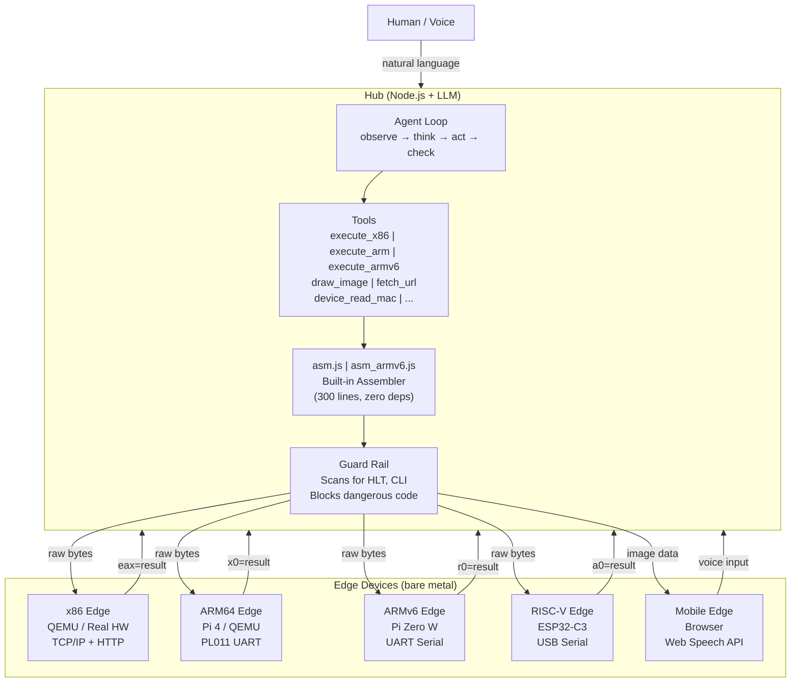
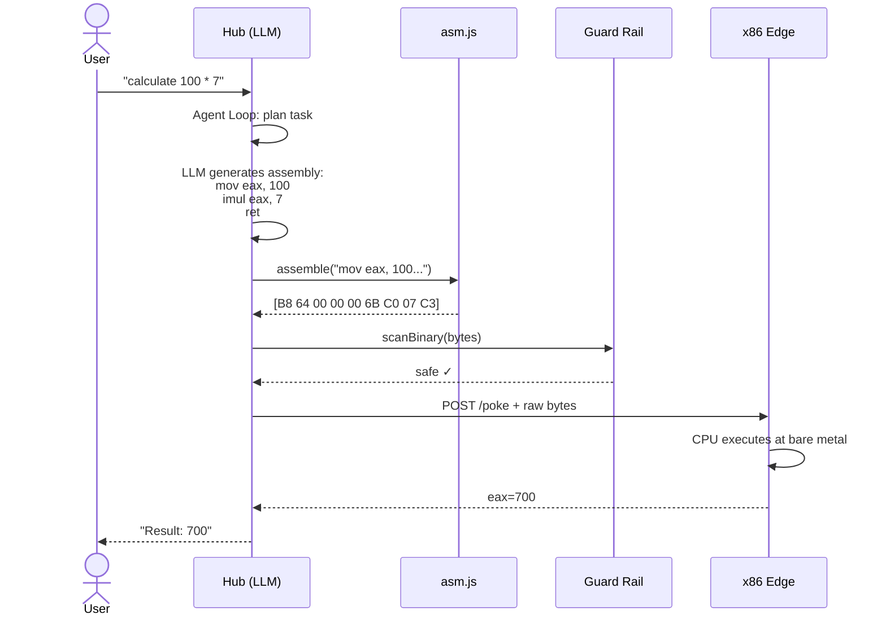
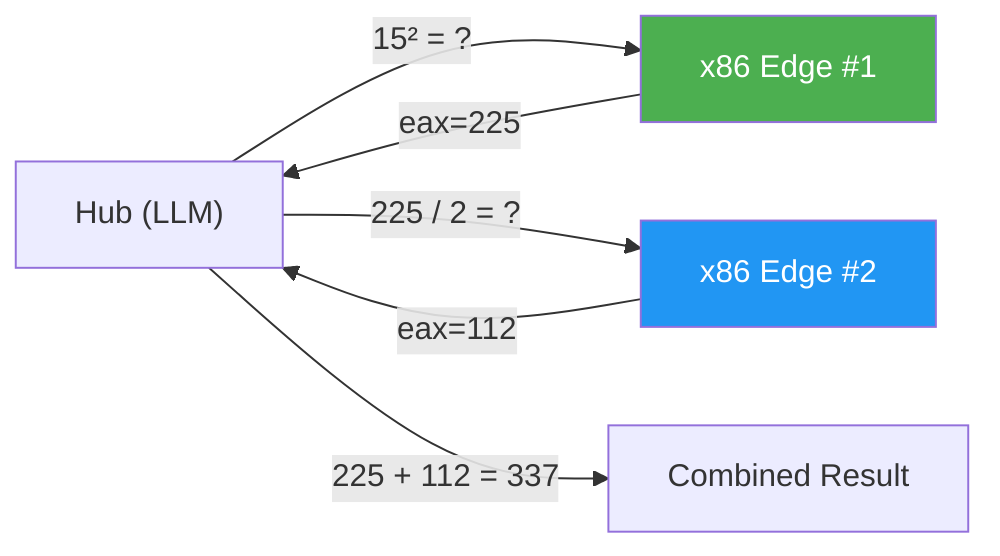
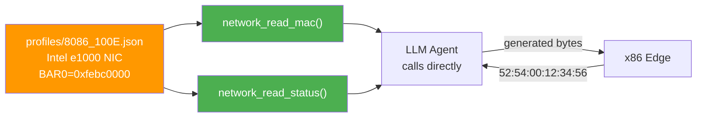
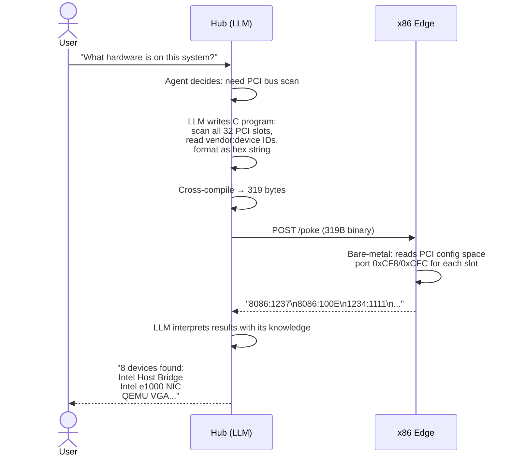
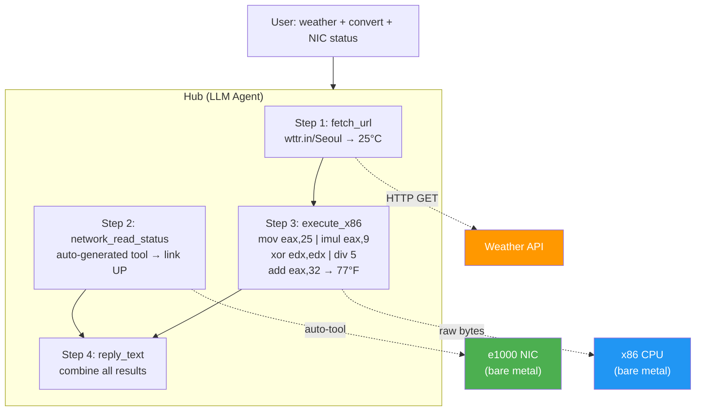
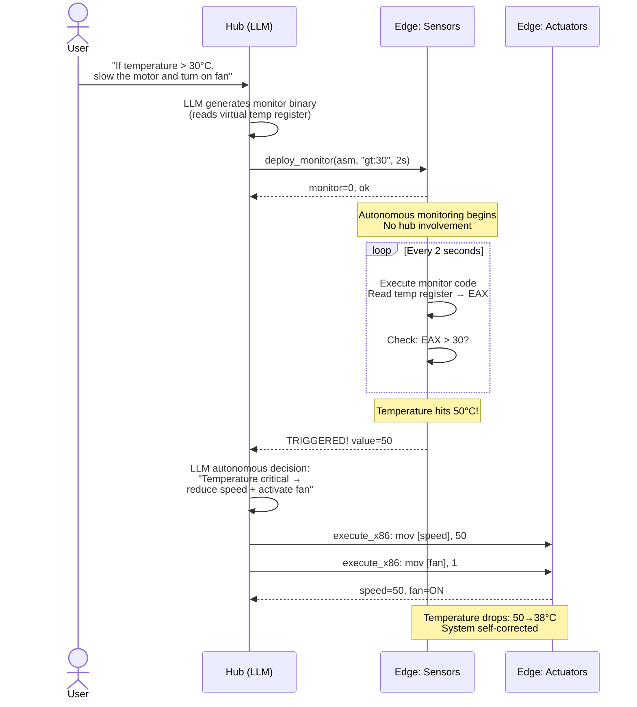
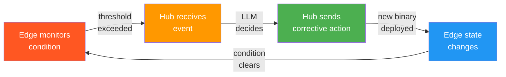
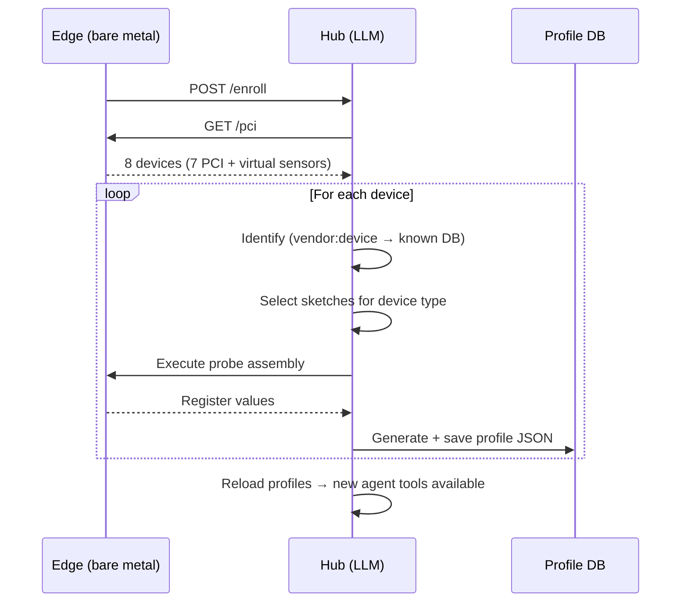

<p align="center">
  <h1 align="center">POKE</h1>
  <p align="center"><strong>Protocol for Open Kernel Execution</strong></p>
  <p align="center">by <strong>Orvian</strong> — from Orbit and Via, the path that carries intelligence into machines.</p>
  <p align="center">
    <a href="https://www.npmjs.com/package/@orvian/poke"></a>
    <a href="LICENSE"></a>
    <a href="#quick-start">Quick Start</a> &middot;
    <a href="#why-poke-exists">Why</a> &middot;
    <a href="#architecture">Architecture</a> &middot;
    <a href="#protocol">Protocol</a> &middot;
    <a href="CONTRIBUTING.md">Contributing</a>
  </p>
</p>

---

**MCP connects AI to software. POKE connects AI to hardware.**

```
You: "Calculate 2 + 3"
  → Hub (LLM): generates x86 machine code
  → Edge (bare metal): executes raw bytes on CPU
  → Result: eax=5
```

No operating system. No drivers. No apps. Just AI talking directly to hardware.

---

## Why POKE Exists

### The OS was built for humans, not for AI.

Operating systems exist because humans needed abstraction. We couldn't write raw machine code for every task, so we built layers:

```
1960s  Hardware only          Humans write machine code by hand
1970s  Operating Systems      Abstraction layer — files, processes, memory management
1980s  Drivers                Hardware abstraction — one interface for many devices
1990s  Libraries & Frameworks Code reuse — don't reinvent the wheel
2000s  App Stores             Distribution — package everything into apps
2020s  AI / LLM               Machines that understand language and generate code
```

Every layer was created because **humans couldn't do it themselves**. The OS, drivers, libraries — they're all **pre-built solutions for human limitations**.

But LLMs don't have those limitations. An LLM can:
- Generate machine code on the fly (no need for pre-compiled binaries)
- Understand any hardware spec (no need for pre-written drivers)
- Interpret natural language (no need for app UIs)

**If "pre-building" is unnecessary, the OS is unnecessary.**

What remains is the bare minimum: hardware + network + a protocol to inject and execute code.

That's POKE.

```
Traditional:  Human → App → Framework → OS → Driver → Hardware
POKE:         Human → LLM → Machine Code → Hardware
```

### The End of Permanent Binaries

Every program you use today is a **permanent binary** — compiled once, installed, stored on disk, updated periodically. This made sense when compilation was expensive and humans needed stable, repeatable software.

But POKE flips this model. Binaries become **ephemeral**:

```
Traditional (permanent):
  Write code → compile → install → store on disk → run forever
  Update? Recompile → reinstall → restart

POKE (ephemeral):
  Speak → LLM generates binary → inject → execute → discard
  Next request? Generate a new binary from scratch
```

A POKE binary lives for **milliseconds**. It's generated on demand, tailored to the exact request, executed once, and thrown away. There's nothing to install, nothing to update, nothing to patch.

This changes everything:
- **No software updates.** Every execution is freshly generated.
- **No version conflicts.** There's no installed version — just the current intent.
- **No attack persistence.** Malware can't persist in a binary that doesn't exist after execution.
- **No bloat.** Each binary contains exactly the code needed — nothing more.

The future isn't permanent software running on an OS. It's **volatile binaries generated in real-time by AI, executed directly on hardware, and discarded.**

### POKE vs MCP

| | MCP | POKE |
|---|---|---|
| Connects AI to | Software tools | Hardware devices |
| Execution | API calls (JSON-RPC) | Machine code injection |
| Abstraction | High | None (bare metal) |
| Controls | Apps, databases, APIs | Registers, GPIO, peripherals |
| Requires | Tool server | Edge runtime + device profile |

MCP gives AI hands in the software world. POKE gives AI hands in the physical world.

---

## Quick Start

### 1. HEX Autonomous Federation (recommended)

Talk to a self-operating multi-site system. 3 hubs, 9 bare-metal edges, 1 LLM orchestrator — no hardware needed:

```bash
git clone https://github.com/CSP911/poke.git
cd poke
npm install

# Configure API key
cp .env.example .env
# Edit .env — add your Anthropic API key:
#   ANTHROPIC_API_KEY=sk-ant-your-key-here
#   HUB_SECRET=poke-secret

# Run autonomous multi-hub federation
node hex/autonomous.js
```

The system boots 9 QEMU bare-metal edges across 3 sites (Office, Factory, Warehouse), starts 3 independent hubs, and begins autonomous monitoring. No human input needed — the LLM detects anomalies and executes corrective actions:

```
═══ Cycle 1 ═══
  Office       entrance:26.2C  workspace:27.2C  server-room:26C
  Factory      line-1:26C  line-2:26.8C  quality:27C
  Warehouse    dock:25.6C  storage:27.4C  cold-room:26C
  HEX: All clear ✓

═══ Cycle 2 ═══
  server-room: 31C!
  HEX: "위험! 쿨링팬 켠다"
  >>> ACTION: office-server-room GPIO 0 = 1 — {"pin":0,"value":1} ✅
```

### Other modes

```bash
node hex/cli.js              # Interactive chat with 10 edges
node hex/federation.js       # Multi-hub with @hub targeting
node hex/simulator.js        # Dynamic events simulation
node hex/scenarios.js        # Run 8 automated LLM decision tests
```

### 2. Docker (x86 single edge)

```bash
docker compose up --build    # x86 kernel + hub + dashboard
open http://localhost:3333/ui
```

### 3. ESP32-C3 Serial Demo

Real hardware (ESP32-C3 RISC-V) connected via USB serial — hub compiles RISC-V assembly, sends binary over serial, ESP32 executes bare-metal and returns the result:

<p align="center">
  
</p>

### Configuration

| Variable | Required | Description |
|----------|:--------:|-------------|
| `ANTHROPIC_API_KEY` | Yes | Claude API key ([get one here](https://console.anthropic.com/)) |
| `HUB_SECRET` | No | Bearer token for hub authentication |
| `LOG_LEVEL` | No | `debug`, `info` (default), `warn`, `error` |
| `PORT` | No | Hub port (default: 3333) |

> **Platform:** macOS (Apple Silicon / Intel), Linux x86_64. Requires QEMU and cross-compilers for kernel builds.

### Example Commands

```
"calculate 100 * 7"                          → assembly → bare-metal → eax=700
"what hardware is connected?"                → PCI scan → C binary → device list
"read the network card MAC address"          → auto-generated tool → 52:54:00:12:34:56
"get Seoul weather, convert to Fahrenheit"   → fetch API + CPU compute → 25°C = 77°F
"read temperature from all sensors"          → distributed sensor query
"1234567 * 7654321"                          → 32-bit overflow proves real CPU execution
```

Each command shows the **execution flow**: which tools were called, what assembly was generated, which edge executed it, and the result.

---

## Architecture



### How a Request Flows



### Multi-Edge Parallel Execution



### Device Profile → Auto-Generated Tools



### The Same Agent Loop as Claude Code / Codex

The hub runs the exact same simple loop that powers Claude Code, Codex, and Devin:

```
while not done:
    observe()   →  read context, check state
    think()     →  LLM decides next action
    act()       →  call a tool
    check()     →  verify result, retry if failed
```

The only difference is **what the tools are**:

```
Claude Code                           POKE
───────────                           ────
tool: edit_file                       tool: execute_x86
params: {                             params: {
  path: "main.py",                      target: "x86-edge",
  content: "print('hi')"                asm_code: "mov eax,2\nadd eax,3\nret"
}                                     }

tool: bash                            tool: build_and_deploy
params: {                             params: {
  command: "npm test"                   target: "x86-edge",
}                                       c_code: "void _start() { ... }"
                                      }

tool: read_file                       tool: network_read_mac
params: {                             params: {
  path: "config.json"                   target: "x86-edge"
}                                     }
```

**The device IS the tool. The assembly IS the parameter.**

The LLM autonomously chains tools in a single turn: fetch external APIs, read hardware registers, compute across edges, generate images — deciding on its own what to do and retrying on failure.

### Device Profiles = Auto-Generated Tools

Device profiles describe hardware (registers, capabilities). When loaded, each operation becomes an agent tool **automatically**:

```
profiles/8086_100E.json:
  operations: [
    { name: "read_mac",    asm: "..." },
    { name: "read_status", asm: "..." }
  ]

  → Auto-generated tools:
    network_read_mac()     — LLM can call directly
    network_read_status()  — No assembly knowledge needed
```

More profiles = more tools = more devices POKE can control.

### Three-Layer Guard Rail

Every binary is scanned before execution:

```
Layer 1: asm.js (hub)
  Scans assembled bytes for dangerous opcodes (HLT, CLI, WBINVD),
  dangerous I/O ports (system reset), writes to protected memory.

Layer 2: hub/compiler.js (hub)
  Validates before sending to edge.
  Rejected binaries are never transmitted.

Layer 3: kernel.c (edge, bare metal)
  Last defense. Scans code buffer at the metal level.
  Returns "REJECTED" HTTP response if dangerous code found.
```

---

## Protocol

Full specification: [PROTOCOL.md](PROTOCOL.md)

### Hub Endpoints

| Method | Path | Description |
|--------|------|-------------|
| POST | `/enroll` | Register edge (auto-triggers incubation) |
| GET | `/nodes` | List connected edges |
| POST | `/relay` | Natural language → agent loop → execute |
| POST | `/run` | Direct LLM → assembly → execute |
| POST | `/goal` | Start goal-based autonomous control |
| POST | `/goal/stop` | Stop active goal |
| GET | `/goal` | Current goal status + cycle history |
| POST | `/scenario/start/:id` | Auto-provision env + run scenario |
| GET | `/incubate/:id` | Trigger device incubation |
| GET | `/asmcache` | List cached assembly templates |
| GET | `/edge/context` | Read context from edge disks |

### Edge Endpoints (bare-metal kernel)

| Method | Path | Description |
|--------|------|-------------|
| GET | `/health` | Health + virtual registers + monitor status + context count |
| GET | `/pci` | PCI device list (real + virtual sensors) |
| GET | `/store` | Read context entries from disk |
| GET | `/key` | Last keyboard scancode |
| POST | `/poke` | Code injection (dispatches by magic bytes) |

### Binary Protocols (POST /poke body)

```
Raw bytes     → code execution → returns eax value
"CTX" + data  → context store write (persistent disk)
"MON" + data  → deploy condition monitor (4 slots)
"RES" + data  → deploy resident binary (persistent control loop, 4 slots)
"STP" + slot  → stop resident binary
"DIE"         → graceful QEMU shutdown
"IMG" + data  → image display
"STR" + data  → frame streaming
"DRAW" + data → procedural drawing
```

---

## Project Structure

```
poke/
├── kernel/                   Bare-metal kernels (6 architectures)
│   ├── x86/                  x86 (QEMU, Docker) — TCP/IP + HTTP + VirtIO
│   ├── arm64/                ARM64 (QEMU virt) — PL011 UART
│   ├── rv32/                 RISC-V 32 (QEMU virt) — NS16550 UART
│   ├── pi0w/                 Pi Zero W (real HW + QEMU) — Mini UART
│   ├── pi4/                  Pi 4 (real HW) — PL011 UART
│   └── esp32c3/              ESP32-C3 (Direct Boot) — USB-Serial/JTAG
│
├── src/                      Built-in assemblers (zero deps)
│   ├── hub.js                Hub entry point
│   ├── asm.js                x86 assembler
│   ├── asm_arm.js            ARM64 assembler
│   ├── asm_armv6.js          ARMv6 assembler (Pi Zero W)
│   └── asm_rv.js             RISC-V assembler (RV32IM)
│
├── hub/                      Hub modules
│   ├── server.js             HTTP routing + auth
│   ├── agent.js              LLM agent loop + tool definitions
│   ├── serial.js             Serial + TCP transport (POKE frame protocol)
│   ├── library.js            Device library — modular matching + auto-incubation
│   ├── compiler.js           Assembly compilation + guard rail
│   ├── transport.js          Edge communication (HTTP)
│   ├── nodes.js              Node registry + health check
│   ├── memory.js             Persistent memory (monthly files, patterns)
│   └── logger.js             Structured logging
│
├── library/                  Device library (17 entries, architecture-neutral)
│   ├── index.json            Device ID → entry mapping (v3.0)
│   ├── esp32c3_base.json     ESP32-C3 chip base
│   ├── bcm2835_base.json     Pi Zero W chip base
│   ├── intel_e1000.json      Intel NIC (register map)
│   ├── virtio_blk.json       VirtIO block device
│   ├── ns16550.json          NS16550 UART
│   ├── dht22.json            Temperature/humidity sensor
│   ├── bmp280.json           Barometric pressure sensor
│   ├── bh1750.json           Ambient light sensor (lux)
│   ├── mq135.json            Air quality gas sensor
│   ├── mpu6050.json          6-axis IMU (accel + gyro)
│   ├── hcsr501.json          PIR motion sensor
│   ├── relay_2ch.json        2-channel relay
│   ├── relay_4ch.json        4-channel relay
│   ├── ir_transmitter.json   IR blaster (NEC/Samsung)
│   ├── ssd1306.json          OLED display (128x64)
│   └── fab_*.json            Factory simulation (cleanroom, etch)
│
├── hex/                      HEX — Hub-Edge eXecutor
│   ├── cli.js                Interactive CLI (10 edges)
│   ├── simulator.js          Live simulation (dynamic events)
│   ├── federation.js         Multi-hub interactive (3 hubs × 3 edges)
│   ├── autonomous.js         Self-operating orchestrator (no human input)
│   ├── scenarios.js          LLM decision tests (8 scenarios)
│   ├── config.json           10-edge configuration
│   └── federation.json       3-hub federation configuration
│
├── test/                     480+ automated tests
│   ├── asm*.test.js          Assembler tests (x86, ARM64, ARMv6, RV32)
│   ├── hub.test.js           Hub endpoint tests
│   ├── library.test.js       Device library tests (207)
│   ├── qemu.test.js          QEMU integration tests (20)
│   └── serial.test.js        ESP32 serial pipeline tests
│
├── web/                      Dashboard UI
├── demo/                     Demo recordings
├── docs/                     Documentation + patents
└── docker-compose.yml        One-command Docker startup
```

---

## What Makes POKE Different

### LLM as the Compiler

POKE doesn't need gcc, clang, or any traditional compiler. The LLM generates machine code directly:

```
20 tests, 3 difficulty levels — no assembler, raw hex bytes only:

                     Opus 4.8    Opus 4.6    Haiku 4.5
  Easy (arithmetic)    6/6         6/6         6/6
  Medium (multi-op)    8/8         8/8         8/8
  Hard (loops, logic)  6/6         2/6         2/6

  Total              20/20 (100%) 16/20 (80%) 16/20 (80%)
```

**Opus 4.8 scores 100% — the assembler is officially optional.** It correctly generates raw bytes for fibonacci, factorial, popcount, and loop summation — including relative jump offsets. No assembler, no compiler, just LLM → bytes → CPU.

For older models, `asm.js` (300 lines of JS, 45 tests, byte-identical to nasm) bridges the gap.

### Task-Level Parallelism

POKE doesn't parallelize binaries — it parallelizes **intent**:

```
User: "Compute 15² on x86, then divide by 2 on ARM"

  → Hub decomposes the task semantically
  → Step 1: x86 edge computes 15² = 225        (171ms)
  → Step 2: ARM edge computes 225 / 2 = 112    (175ms)
  → Both run on different bare-metal CPUs

Benchmark (50M iterations × 4, split across 2 edges):
  Single:   349ms
  Parallel: 175ms
  Speedup:  1.99x
```

### Real-World Examples

POKE isn't just for arithmetic. The agent decomposes real questions into binary-level operations:

#### "What hardware is connected to this machine?"



**What happened:** The LLM wrote a PCI scanner in C, compiled it to a 319-byte binary, injected it into bare metal, and interpreted the raw register values — all from one natural language question.

#### "Is the network card working? What's its MAC address?"

```
Agent steps:

  Step 1: list_devices()
    → "8086:100E Intel 82540EM (e1000) — operations: network_read_mac, network_read_status"

  Step 2: network_read_status()        ← auto-generated from device profile
    → eax=2148009859 (0x80200783)
    → Agent interprets: bit 1 = 1 → link is UP

  Step 3: build_and_deploy()           ← LLM writes C to format full MAC
    → e1000_read_mac(&nic, mac)
    → poke_format_mac(mac, buf)
    → 221 bytes deployed → "52:54:00:12:34:56"

  Step 4: reply_text()
    → "e1000 NIC is UP. MAC: 52:54:00:12:34:56"
```

**What happened:** The agent mixed auto-generated tools (from profile) with a custom C binary (for formatting) — choosing the right approach for each sub-task.

#### "Get Seoul weather, convert to Fahrenheit on the CPU, check NIC status"



**What happened:** One question triggered three different tool types — external API, hardware register read, and CPU computation — all orchestrated by the LLM in a single turn.

#### "If outside temperature > sensor reading, turn on AC"

The hub fetches external data and embeds it directly into the binary:

```
Hub: fetch(weather API) → 25°C
Hub: generates bare-metal binary:

  int outside = 25;                      // ← hub-injected external data
  int inside = read_sensor(0xfebc0000);  // ← hardware register read
  if (outside > inside)
      gpio_set(PIN_AC, 1);              // ← hardware control

Edge: executes autonomously. No OS. No network needed after deployment.
```

This is the pattern unique to POKE: **external data (from hub) + local hardware (from edge) in one binary**, deployed once, runs forever.

#### Distributed Sensor Monitoring

```
User: "Read temperature from all sensors, compare with Seoul outside temp"

  → Step 1: fetch_url(wttr.in/Seoul)          → 21°C (external API)
  → Step 2: sensor_read_temperature(sensor-A)  → 20.42°C (edge hardware)
  → Step 3: sensor_read_temperature(sensor-B)  → 20.35°C (edge hardware)
  → Step 4: reply_text → combined analysis:

  | Location    | Temperature |
  |-------------|-------------|
  | Seoul (outside) | 21.00°C |
  | Sensor A (indoor) | 20.42°C |
  | Sensor B (indoor) | 20.35°C |

  "Indoor is 0.6°C cooler than outside. Both sensors consistent."
```

**What happened:** The agent combined an external weather API with two bare-metal sensor readings from different edge devices, then analyzed the data — three sources, one natural language answer.

### Autonomous Event Loop — JARVIS Mode

POKE edges can **think for themselves**. Deploy a condition monitor to an edge, and it autonomously checks, triggers, and fires events back to the hub — where the LLM decides what to do next. No human in the loop.



**Actual test output from QEMU:**

```
🔥 MONITOR TRIGGERED!
   Edge: x86-qemu
   Value: 50 (temperature)
   State: temp=50 speed=100 fan=0

   → LLM deciding...

=== LLM DECIDED ===
   Tool: execute_x86
   ASM: mov dword [0x200004], 50     ← motor speed 100→50
   Tool: execute_x86
   ASM: mov dword [0x200008], 1      ← fan OFF→ON

   LLM says: "Motor speed reduced, fan activated."

=== AFTER LLM ACTION ===
   temp=38  speed=50  fan=1

✅ LLM autonomously modified edge state!
```

The full cycle — **sense → decide → act** — happens without any human intervention. The edge monitors hardware, the hub's LLM makes decisions, and the system self-corrects.



This is the difference between a remote control and an autonomous system. POKE edges don't wait for commands — they **react**.

### Goal Mode — LLM as Autonomous Controller

Goal Mode takes autonomy further. Instead of reacting to triggers, the LLM **proactively maintains a goal**:

```
User: "Maintain temperature below 30°C. Keep web/db servers running. Save energy."
  │
  ▼
Hub (LLM) plans:
  → Read current state (temp=80°C — critical!)
  → Deploy resident binary for continuous monitoring
  → Increase cooling to MAX
  → Shut down low-priority servers
  │
  ▼ (every 15 seconds)
Hub checks progress:
  Cycle 1: temp=60, power=900W → "Still high, maintaining MAX cooling"
  Cycle 2: temp=40, power=850W → "Improving. Keep current settings."
  Cycle 3: temp=28, power=750W → "GOAL MET. Reducing cooling to save energy."
```

The LLM chooses between 4 execution modes based on what the goal needs:

| Request | LLM Choice | Mode |
|---------|-----------|------|
| "Read temperature" | One-shot | `execute_x86` |
| "Alert if temp > 30" | Conditional trigger | `deploy_monitor` |
| "Run PID control loop" | Persistent loop | `deploy_resident` |
| "Keep temp below 30" | Autonomous control | **Goal Mode** |

### Device Incubation — Automatic Hardware Discovery

When an edge connects, the hub automatically discovers and profiles all hardware:



Sketch library provides pre-built assembly templates:

```json
{
  "network": {
    "read_mac_mmio": {
      "asm": "BITS 32\nmov ebx, {{BAR0}}\nmov eax, [ebx + 0x5400]\nret",
      "params": ["BAR0"]
    }
  },
  "sensor": {
    "read_value": {
      "asm": "BITS 32\nmov eax, [{{ADDR}}]\nret",
      "params": ["ADDR"]
    }
  }
}
```

### Resident Binaries — Persistent Control Loops

Unlike ephemeral binaries, resident binaries run continuously on the edge:

```
Ephemeral:  generate → execute → discard (milliseconds)
Resident:   generate → deploy → runs forever (survives reboot)

┌─── Task 0: Kernel ─────────────────┐
│ HTTP server + network polling       │
│        ⚡ PIT interrupt (10ms)       │
│        ↕ context switch              │
├─── Task 1: PID Controller ─────────┤
│ while(1) { read_sensor → adjust }   │
├─── Task 2: Data Logger ────────────┤
│ while(1) { collect → write_disk }   │
├─── Task 3: Safety Monitor ─────────┤
│ while(1) { check → alert if needed }│
└─────────────────────────────────────┘
```

Preemptive multitasking via PIT timer + IDT ensures the kernel stays responsive while resident code runs.

### Persistent Context — VirtIO Disk Storage

Edge devices remember across reboots:

```
Hub writes context → CTX protocol → VirtIO-blk driver → disk sector
Edge reboots → ctx_store_init() → reads header from disk → data restored
Hub reads back → GET /store → entries from disk

Tested: write 3 entries → reboot → all 3 entries survived ✅
```

---

## Roadmap

- [x] x86 bare-metal OS (boot → protected mode → TCP/IP → HTTP → code exec)
- [x] ARM64 bare-metal OS (UART + serial protocol)
- [x] Hub with LLM agent loop (tool use, multi-step reasoning)
- [x] Built-in x86 assembler (`asm.js`) + ARM64 assembler (`asm_arm.js`)
- [x] Device profiles → auto-generated agent tools (26 profiles)
- [x] Three-layer guard rail (asm.js + hub + kernel)
- [x] Voice pipeline (STT → LLM → execute → TTS)
- [x] Multi-edge orchestration + parallel execution (1.99x speedup)
- [x] Distributed computing (parallel_execute + load balancing)
- [x] Docker one-command setup
- [x] Autonomous event loop (edge monitors → LLM auto-decision → corrective action)
- [x] JARVIS memory system (monthly files, keyword index, edge sync)
- [x] VirtIO-blk disk driver + persistent context store (survives reboot)
- [x] Preemptive multitasking (IDT + PIT timer + context switching)
- [x] Resident binaries (persistent control loops, 4 slots, disk-backed)
- [x] PCI device discovery + auto-incubation (sketches → probe → profile)
- [x] Assembly cache (reusable parameterized templates, 14 sketches)
- [x] Goal Mode (LLM-driven autonomous control: plan → monitor → adjust)
- [x] Factory simulation (3 QEMU edges, real shutdown/restart)
- [x] Scenario auto-provisioning (0 → N edges on demand)
- [x] Live trace system (SSE streaming of all hub events)
- [x] Self-extending kernel (module loader from disk)
- [x] 59 automated tests (35 unit + 24 integration)
- [x] ESP32-C3 RISC-V edge (USB serial, POKE frame protocol, bare-metal code exec)
- [x] Internal temperature sensor (ESP-IDF calibrated, LLM-driven read)
- [x] Result validation layer (sanity check + LLM self-correction loop)
- [x] Serial integration tests (16 tests: PING/INFO/GPIO/TEMP + arithmetic + hub API)
- [x] Autonomous event loop — edge-initiated EVNT frames + LLM-driven monitor deploy
- [x] Modular device library — chip base + sensor modules, auto-incubation via LLM
- [x] POKE OS on 6 platforms — x86 + ARM64 + RV32 + ESP32-C3 + Pi Zero W + Pi 4
- [x] RV32 bare-metal kernel (no FreeRTOS) — pure POKE OS for RISC-V
- [x] ESP32-C3 bare-metal POKE kernel — Direct Boot, 3.5KB, no FreeRTOS/ESP-IDF
- [x] Pi Zero W bare-metal kernel — verified on real hardware (2.8KB, ARMv6)
- [x] Pi 4 bare-metal kernel — BCM2711, AArch64, PL011 UART
- [x] ARMv6 mini assembler (asm_armv6.js) — Pi Zero W code injection
- [x] Modular device library — bcm2835_base with WiFi (SDIO) + Camera (CSI) incubating
- [x] 388+ automated tests (including 66 ARMv6 + 135 library tests)
- [ ] POKE OS on Pi 4 ARM — kernel built, pending real hardware verification
- [ ] Device library marketplace
- [ ] CR3 page table isolation for resident tasks

---

## Industry Targets

POKE is most valuable where hardware is fragmented, legacy equipment is alive, and software maintenance costs are high.

### Phase 1: Smart Farm & Smart Factory

```
Problem:
  Factory: 10 PLCs, 5 CNCs, 50 sensors — each with different protocols
           (Modbus, OPC-UA, PROFINET). Adding one machine = 6 months + integrator.
  Farm:    Soil sensors, valves, fans, CO2 sensors — all different vendors.
           Internet unreliable. Must work offline.

POKE:
  Attach one edge per device → profile auto-discovery
  "Set conveyor speed to 120 RPM" → hub reads Modbus profile → generates register write
  "If temperature > 30°C and humidity < 70%, turn on mist" → binary deployed, runs offline

Value: Integration cost -90%. Legacy equipment modernized without replacement.
```

### Phase 2: Industrial Robotics

```
Problem:
  FANUC, ABB, KUKA, Hyundai Robotics — each has its own language and IDE.
  Replace one robot = rewrite all programs.
  Vision + gripper + sensor integration is custom every time.

POKE:
  "Pick red parts from conveyor, move to line B" → hub generates robot commands
  Switch robot brand? Change the profile, same commands work.
  Camera → multimodal LLM → real-time motion adjustment

Value: Vendor independence. One protocol for any robot.
```

### Phase 3: Building Automation

```
Problem:
  HVAC + lighting + elevators + access control + fire safety
  BACnet, KNX, LonWorks, Modbus — mixed protocols, $M+ to replace BMS.

POKE:
  Bridge into existing BMS → profile each subsystem
  "If meeting room is empty, dim lights to 30%, reduce HVAC"
  Hub integrates Google Calendar + occupancy sensors + HVAC control

Value: 30% energy savings. No BMS replacement needed.
```

### Future: Autonomous Vehicles, Defense, Maritime

```
Automotive:  100+ ECUs on CAN bus → diagnostics & analysis (read-only first)
Defense:     Closed networks, offline autonomy, minimal attack surface
Maritime:    Engine + navigation + cargo — unreliable connectivity, onboard hub
Mining:      Remote sites, hazardous environments, autonomous monitoring
```

### Industry Fit Matrix

| Industry | HW Fragmentation | Legacy | Real-time | Offline | Market |
|----------|:---:|:---:|:---:|:---:|:---:|
| Smart Factory | ★★★★★ | ★★★★★ | ★★★★ | ★★★ | $300B |
| Smart Farm | ★★★ | ★★ | ★★★ | ★★★★★ | $25B |
| Robotics | ★★★★ | ★★★ | ★★★★★ | ★★ | $70B |
| Building | ★★★★★ | ★★★★ | ★★★ | ★★ | $120B |
| Medical | ★★★★ | ★★★★ | ★★ | ★★ | $500B |
| Automotive | ★★★ | ★★ | ★★★★★ | ★★★ | $200B |

---

## Contributing

See [CONTRIBUTING.md](CONTRIBUTING.md). The easiest way to start:

1. **Add a device profile** — if you have hardware, scan it and submit a profile
2. **Test on real devices** — Raspberry Pi, STM32, ESP32
3. **Extend asm.js** — add more x86 instruction encodings
4. **Write tutorials** — "Control an LED with POKE in 5 minutes"

---

## License

[Apache 2.0](LICENSE)

---

<p align="center">
  <em>"The future doesn't need an operating system."</em>
</p>
