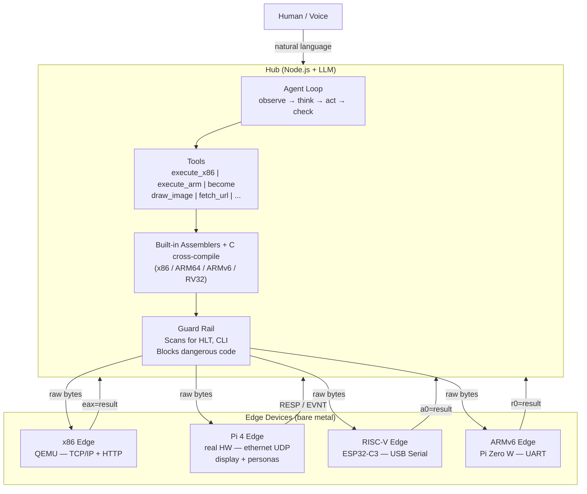
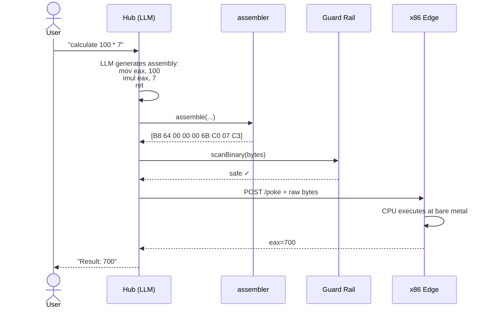

<p align="center">
  <h1 align="center">POKE</h1>
  <p align="center"><strong>Protocol for Open Kernel Execution</strong></p>
  <p align="center">by <strong>Orvian</strong> — from Orbit and Via, the path that carries intelligence into machines.</p>
  <p align="center">
    <a href="https://www.npmjs.com/package/@orvian/poke"></a>
    <a href="LICENSE"></a>
    <a href="#quick-start">Quick Start</a> &middot;
    <a href="#why-poke-exists">Why</a> &middot;
    <a href="#architecture">Architecture</a> &middot;
    <a href="#protocol">Protocol</a> &middot;
    <a href="CONTRIBUTING.md">Contributing</a>
  </p>
</p>

---

**MCP connects AI to software. POKE connects AI to hardware.**

```
You: "Calculate 2 + 3"
  → Hub (LLM): generates x86 machine code
  → Edge (bare metal): executes raw bytes on CPU
  → Result: eax=5
```

No operating system. No drivers. No apps. Just AI talking directly to hardware.

---

## Demo

https://github.com/user-attachments/assets/4b450f18-5bbd-4b33-8551-fdb3ebc09ebd

```bash
./bin/poke become "Turn this device into a 30-second ramen timer. Flash the screen when time is up"
./bin/poke become "Turn this device into a SoC thermometer. Show a warning when it goes over 60 degrees"
./bin/poke become "Turn this device into a clock"
```

The LLM writes freestanding C on the spot, the hub compiles it to ~600 bytes of
aarch64 machine code, and a bare-metal Raspberry Pi 4 transforms into a ramen
timer — countdown, alarm flash and all. Ask again and it becomes a clock, a
thermometer, anything. The binary is volatile: power-cycle and it's gone.

**LLM writes C. The device receives only machine code.** The C source exists
only on the hub — an intermediate representation on the way to machine code.
The device has no compiler, no loader, no filesystem: it receives raw bytes
over UDP, places them in memory, and jumps to them.

```
natural language ──▶ C source (LLM) ──▶ aarch64 machine code (gcc) ──▶ bare metal
                     dies on the hub     the only thing that travels

fd7b bda9 fd03 0091 ...   ← 590 bytes sent over UDP
   0:  a9bd7bfd  stp  x29, x30, [sp,#-48]!    ← function prologue
  18:  52830500  mov  w0, #0x1828             ← background color
  20:  d63f0020  blr  x1                      ← call api->clear()
```

Generation takes tens of seconds, so repeated requests hit a **self-growing
persona cache**: the first "timer" is generated and cached with its parameters
declared; every later "N-second timer" replays the same binary with a patched
parameter in ~1s. Voice works too — `poke voice` (local whisper + VAD) and
`poke hex`, an always-on wake-word assistant that also receives autonomous
events the device fires back (`api->emit` → notification + TTS).

---

## Why POKE Exists

### The OS was built for humans, not for AI.

```
1960s  Hardware only          Humans write machine code by hand
1970s  Operating Systems      Abstraction — files, processes, memory
1980s  Drivers                One interface for many devices
1990s  Libraries/Frameworks   Code reuse
2000s  App Stores             Distribution
2020s  AI / LLM               Machines that understand language and generate code
```

Every layer exists because **humans couldn't do it themselves**. LLMs don't
have those limitations: they generate machine code on the fly, understand any
hardware spec, and take natural language as the interface. If "pre-building"
is unnecessary, the OS is unnecessary. What remains is the bare minimum:
hardware + network + a protocol to inject and execute code. That's POKE.

```
Traditional:  Human → App → Framework → OS → Driver → Hardware
POKE:         Human → LLM → Machine Code → Hardware
```

### The End of Permanent Binaries

A POKE binary is **ephemeral**: generated on demand, tailored to the exact
request, executed, discarded. Nothing to install, update, or patch.

- **No software updates** — every execution is freshly generated
- **No version conflicts** — there is no installed version, just the current intent
- **No attack persistence** — malware can't persist in a binary that no longer exists
- **No bloat** — each binary contains exactly the code needed

### POKE vs MCP

| | MCP | POKE |
|---|---|---|
| Connects AI to | Software tools | Hardware devices |
| Execution | API calls (JSON-RPC) | Machine code injection |
| Abstraction | High | None (bare metal) |
| Controls | Apps, databases, APIs | Registers, GPIO, peripherals |

MCP gives AI hands in the software world. POKE gives AI hands in the physical world.

---

## Quick Start

### Prerequisites

```bash
# macOS
brew install qemu riscv64-elf-gcc node

# Ubuntu/Debian
sudo apt install qemu-system-misc gcc-riscv64-unknown-elf nodejs npm
```

### 1. HEX Autonomous Federation (no hardware needed)

3 hubs, 9 QEMU bare-metal edges, 1 LLM orchestrator:

```bash
git clone https://github.com/CSP911/poke.git
cd poke
npm install
cp .env.example .env      # add ANTHROPIC_API_KEY=sk-ant-...

node orchestration/autonomous.js
```

The LLM monitors all sites and acts on its own:

```
═══ Cycle 2 ═══
  server-room: 31C!
  HEX: "위험! 쿨링팬 켠다"
  >>> ACTION: office-server-room GPIO 0 = 1 — {"pin":0,"value":1} ✅
```

Other modes: `orchestration/cli.js` (interactive chat), `federation.js`,
`simulator.js`, `scenarios.js`.

### 2. Prompt Appliance CLI (Raspberry Pi 4)

Flash `edge/kernel/pi4/poke.img` to an SD card, connect ethernet
(host 10.0.0.1/24), then:

```bash
./bin/poke ping                          # PONG (5ms)
./bin/poke become "make this a clock"    # LLM → C → machine code → transform
./bin/poke voice                         # speak the request instead
./bin/poke hex                           # always-on wake-word assistant
```

### 3. Distributed Compute

One prompt becomes an instant cluster — the LLM splits the job, writes one
parameterized worker, and a fleet of bare-metal edges computes it:

```bash
./bin/poke burst "Count how many prime numbers there are below 20,000,000" --edges 4

  answer: 1270607          # exact
  wall time: 2.5s  vs  cpu time: 8.9s — speedup ×3.6
```

One 150-byte worker binary; per-chunk parameters are patched into the volatile
code itself. Edge dies? The chunk is just re-dispatched — stateless workers
make fault tolerance free.

### Configuration

| Variable | Required | Description |
|----------|:--------:|-------------|
| `ANTHROPIC_API_KEY` | Yes | Claude API key ([get one](https://console.anthropic.com/)) |
| `HUB_SECRET` | No | Bearer token for hub authentication |
| `LOG_LEVEL` | No | `debug`, `info` (default), `warn`, `error` |
| `PORT` | No | Hub port (default: 3333) |

### Example Commands

```
"calculate 100 * 7"                          → assembly → bare-metal → eax=700
"what hardware is connected?"                → PCI scan → C binary → device list
"read the network card MAC address"          → auto-generated tool → 52:54:00:12:34:56
"read temperature from all sensors"          → distributed sensor query
"1234567 * 7654321"                          → 32-bit overflow proves real CPU execution
```

---

## Architecture



### How a Request Flows



### The Same Agent Loop as Claude Code

The hub runs the same loop that powers coding agents — observe → think →
act → check — with one difference: **the device IS the tool, and the machine
code IS the parameter.** The LLM chains tools autonomously: fetch an API,
read a hardware register, compute across edges, retry on failure.

### Three-Layer Guard Rail

Every binary is scanned before execution:

```
Layer 1: assembler (hub)   — dangerous opcodes (HLT, CLI, WBINVD), I/O ports,
                             protected-memory writes
Layer 2: compiler.js (hub) — validates before sending; rejected binaries
                             are never transmitted
Layer 3: kernel (edge)     — last defense at the metal; returns REJECTED
```

---

## Protocol

Full specification: [PROTOCOL.md](PROTOCOL.md) — enrollment, HTTP endpoints,
serial/TCP framing, the Pi 4 UDP protocol (DRAW / PRUN personas / PPAR
runtime parameters / autonomous EVNT events), and binary formats.

The short version — every transport carries the same idea:

```
"POKE" + length + payload   →   the edge executes or applies it
raw machine code            →   run once, return the result, discard
```

---

## Project Structure

```
poke/
├── edge/                     Edge layer — bare-metal devices
│   ├── kernel/
│   │   ├── x86/              x86 (QEMU) — TCP/IP + HTTP + VirtIO
│   │   ├── arm64/            ARM64 (QEMU virt)
│   │   ├── rv32/             RISC-V 32 (QEMU virt)
│   │   ├── pi0w/             Pi Zero W (real HW + QEMU)
│   │   ├── pi4/              Pi 4 (real HW) — ethernet UDP, display,
│   │   │   └── personas/       LLM-generated resident applets
│   │   └── esp32c3/          ESP32-C3 (Direct Boot, no FreeRTOS)
│   └── library/              Device library (17 entries, architecture-neutral)
│
├── hub/                      Hub layer — intelligence
│   ├── server.js             HTTP routing + auth
│   ├── agent.js              LLM agent loop + tool definitions
│   ├── frame-transport.js    POKE frames over serial / TCP / UDP
│   ├── compiler.js           Assembly compilation + guard rail
│   ├── library.js            Device library matching + auto-incubation
│   └── assembler/            Built-in assemblers (x86, ARM64, ARMv6, RV32)
│
├── orchestration/            Multi-site control (cli / federation / autonomous / ...)
├── bin/poke                  CLI — ping/become/voice/hex/persona/burst
├── lib/cli/                  CLI modules (protocol, persona cache, audio, burst)
├── test/                     490+ automated tests
├── web/                      Dashboard UI
└── index.js                  Hub entry point (`poke-hub`)
```

---

## What Makes POKE Different

**LLM as the compiler.** No pre-built binaries: the LLM writes assembly (or
freestanding C, cross-compiled) per request. Built-in assemblers for 4
architectures, zero external dependencies.

**Volatile, parameterized code.** One generated binary serves many requests —
parameters travel as patched immediates or runtime PPAR values. The persona
cache and the burst scheduler both grow from the same idea: generate once,
replay in milliseconds.

**Devices that speak first.** Personas watch their own conditions on bare
metal and fire autonomous events (`EVNT`) — the hub's LLM interprets and
acts. No polling.

**Self-operating fleets.** The HEX orchestrator monitors multi-site edges,
detects anomalies, and dispatches corrective machine code without human
input. The same scheduling turns idle devices into an instant compute
cluster (`poke burst`).

**Architecture-neutral device library.** 17 entries, register maps only, no
hardcoded assembly — the LLM generates the right code for any ISA at runtime.

---

## Status

Working today: bare-metal POKE OS on 6 platforms (x86, ARM64, RV32, ESP32-C3,
Pi Zero W, Pi 4 with ethernet + display), the LLM agent hub with guard rails,
persona transformation with caching and voice, autonomous edge events, and
distributed compute — verified end-to-end on real hardware, 490+ tests.

Next:
- [ ] Heterogeneous burst fleet — real Pi 4 joins the QEMU workers
- [ ] Touch personas (driver ready; waiting on an intact panel)
- [ ] Real hardware multi-site deployment (Pi 4 + ESP32)

---

## Contributing

See [CONTRIBUTING.md](CONTRIBUTING.md). The easiest way to start:

1. **Add a device library entry** — if you have hardware, scan it and submit it
2. **Write a persona** — small freestanding C applets against `poke_api.h`
3. **Test on real devices** — Raspberry Pi, STM32, ESP32

---

## Contact

Business inquiries, collaboration, or just curious: **qct8377@gmail.com**
Bug reports and questions → [GitHub Issues](https://github.com/CSP911/poke/issues)

---

## License

[Apache 2.0](LICENSE)

---

<p align="center">
  <em>"The future doesn't need an operating system."</em>
</p>
